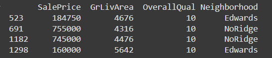

 

# House Prices Prediction - Kaggle Regression Challenge

Projeto de regressão utilizando aprendizado de máquina para prever preços de casas com base em dados do Kaggle. Envolve EDA, tratamento de dados, construção de pipelines e avaliação de modelos como Random Forest, XGBoost e DecisionTree, com tuning via validação cruzada. Utiliza o dataset do desafio Kaggle - House Prices: Advanced Regression Techniques.

##  Objetivos

- Realizar análise exploratória dos dados (EDA)
- Identificar e tratar outliers e dados ausentes
- Construir pipelines para pré-processamento e modelagem
- Avaliar e comparar modelos de regressão
- Otimizar hiperparâmetros com validação cruzada

---

##  Tecnologias utilizadas

- **Linguagem**: Python 3
- **Bibliotecas Principais**:
  - Pandas, NumPy (manipulação de dados)
  - Matplotlib, Seaborn (visualização)
  - Scikit-Learn (modelos e pipelines)
  - XGBoost, LightGBM (modelos ensemble)
- **Ferramentas**:
  - Google Colab (ambiente de notebooks)
  - GridSearchCV (otimização de hiperparâmetros)
  - Pipelines (fluxo de processamento)

---

##  Estrutura do projeto

1. **Configuração inicial**  
   Organização de diretórios e importação das bibliotecas principais.

2. **Carregamento e inspeção dos dados**  
   - Leitura do dataset.  
   - Análise de estrutura (linhas, colunas, tipos de dados).  
   - Uso de `.describe()` para identificar possíveis anomalias como outliers e desvios padrão elevados.

3. **Análise de dados faltantes**  
   - Identificação de colunas com valores ausentes.  
   - Remoção de colunas com grande volume de dados faltantes.  
   - Separação entre variáveis **numéricas** e **categóricas**.

4. **Visualização e análise exploratória (EDA)**  

   **Algumas Descobertas**
   - **Dados ausentes**: Colunas como `PoolQC` (qualidade da piscina) e `MiscFeature` (itens diversos) apresentam mais de 80% de valores faltantes
   - **Distribuição do target**: `SalePrice` mostra assimetria positiva (γ₁ = 1.88), necessitando transformação logarítmica

   **Análise de Outliers**

   

     
     
   

   - Identificados através de boxplots e scatter plots
   - Casos problemáticos:
     - Imóveis com área grande e preço anormalmente baixo
     - Propriedades pequenas com preços 4× acima da média
   - Tratamento: Remoção dos registros inconsistentes.

   **Criação de heatmap de correlação para formulação de hipóteses**

   

   - **Correlações**: `OverallQual`, `GrLivArea` e `GarageCars` mostram alta correlação com o preço
5. **Modelagem e avaliação**  
   - Criação de pipelines de pré-processamento para modelos de regressão.
   - Treinamento com três algoritmos principais:
     - `DecisionTreeRegressor`
     - `RandomForestRegressor`
     - `XGBoostRegressor`
   - Ajuste de hiperparâmetros com `GridSearchCV`
   - Avaliação com a métrica **MAE (Mean Absolute Error)**
---

## Algumas das Hipóteses Formuladas

Com base na análise exploratória e na matriz de correlação entre variáveis numéricas, foram formuladas as seguintes hipóteses para orientar a investigação dos dados:

### H1 — Influência do tempo de venda  
O preço de venda das casas varia de acordo com o ano em que a transação foi realizada.

  

É possível observar um **declínio acentuado entre os anos de 2007 e 2008** no preço médio das casas neste dataset.  
Esse decaimento possivelmente está relacionado à **crise imobiliária dos Estados Unidos em 2008**, que impactou diretamente o mercado de imóveis.

---

### H2 — Área construída como principal fator de valorização  
A área construída da casa influencia diretamente o valor de venda, sendo um dos principais fatores de precificação.

  

### H3 — Impacto da idade e reformas no valor

  

O gráfico acima mostra o **preço médio de venda por ano**, separado por faixas de **ano de construção** dos imóveis.

É possível observar que imóveis mais recentes (`2000+`) mantêm preços significativamente mais altos em todos os anos analisados.  
Isso reforça a hipótese de que **casas mais novas tendem a ter maior valor de mercado**, além de apresentarem **menor depreciação durante crises**, como a de 2008.

### H4 — Efeito da localização na valorização dos imóveis

A localização da casa em determinadas vizinhanças afeta significativamente o preço de venda.  
Algumas vizinhanças concentram os imóveis mais valorizados, indicando disparidades regionais no mercado.

  

O gráfico acima mostra a distribuição dos preços de venda por bairro (`Neighborhood`), evidenciando grandes diferenças regionais.  
Vizinhanças como **NoRidge**, **StoneBr** e **NridgHt** concentram os imóveis com os **preços mais elevados**, enquanto outras como **MeadowV**, **IDOTRR** e **BrDale** apresentam valores bem inferiores.

---

## Resultados dos Modelos
Após a construção dos pipelines de pré-processamento e ajuste de hiperparâmetros com GridSearchCV, três algoritmos de regressão foram avaliados utilizando validação cruzada com as métricas MAE, RMSE e R². A tabela a seguir resume os resultados obtidos:

| Modelo        | MAE       | RMSE      | R²     |
| ------------- | --------- | --------- | ------ |
| Decision Tree | 25,362.69 | 36,424.57 | 0.7598 |
| Random Forest | 16,709.46 | 24,244.99 | 0.8936 |
| XGBoost       | 14,584.63 | 20,754.68 | 0.9220 |

MAE (Mean Absolute Error) indica o erro médio absoluto entre o valor real e o valor predito — quanto menor, melhor.
RMSE (Root Mean Squared Error) penaliza mais os grandes erros.
R² (Coeficiente de Determinação) mede o quanto o modelo explica da variabilidade do target — quanto mais próximo de 1, melhor.

  

***Decision Tree*** apresenta maior dispersão nas predições, indicando menor precisão em relação aos outros modelos.
***Random Forest*** melhora a precisão, com boa concentração de pontos próximos da linha ideal.
***XGBoost apresenta*** o melhor desempenho, com alta aderência à linha de identidade (y = x), demonstrando robustez e baixa margem de erro.

---
##  Dataset

O dataset está disponível publicamente no Kaggle:  
 [House Prices - Advanced Regression Techniques](https://www.kaggle.com/competitions/house-prices-advanced-regression-techniques)

---

##  Aprendizados

- Aplicação prática de EDA com foco em problemas de regressão
- Importância do tratamento de dados faltantes e outliers
- Construção de pipelines reutilizáveis com Scikit-Learn
- Comparação entre modelos de ensemble (Random Forest vs XGBoost)
- Ajuste e avaliação robusta de modelos com validação cruzada

## Licença
 [Licença MIT](./LICENSE).
